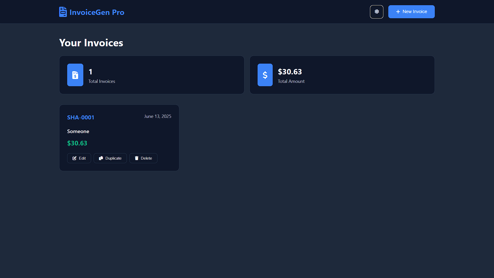
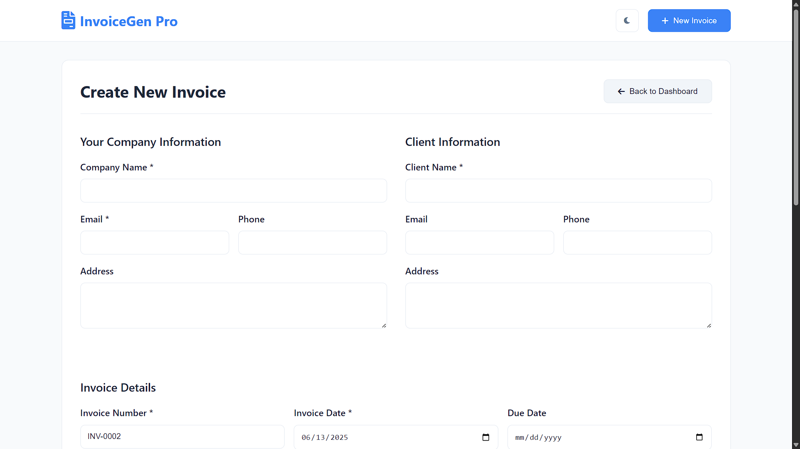
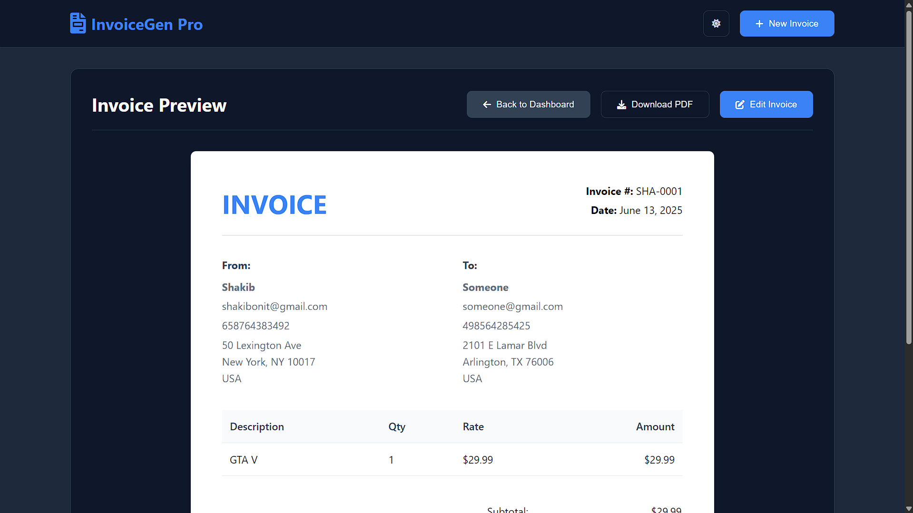
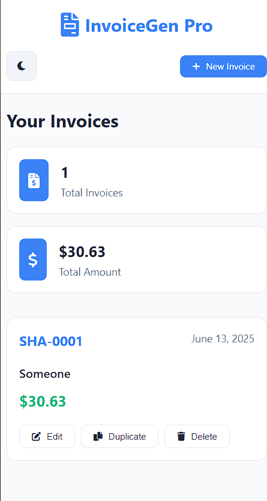

# InvoiceGen 🚀

[](https://shakibcodes.github.io/InvoiceGen/)


---

## 👋 About InvoiceGen

**InvoiceGen** helps you easily create **professional invoices**. It's perfect for freelancers, small businesses, or anyone who needs to send bills quickly.


No more manual work! InvoiceGen helps you make, customize, and manage your invoices fast and accurately.

## ✨ Cool Features

* **⚡️ Quick Invoices:** Make new invoices in just a few minutes.

* **🎨 Make It Yours:** Customize invoices with your own branding and details.

* **💰 Auto Math:** It adds up everything for you (totals, taxes, discounts).

* **🧾 List Items:** Easily add or remove items with prices and descriptions.

* **✅ Save Clients:** Keep client details saved for easy use next time.

* **💾 Export as PDF:** Save your invoices as nice-looking PDFs.

* **🛡️ Safe & Sound:** Built to be reliable and protect your information.

---

## 🚀 How to Use It

Want to run InvoiceGen on your computer? Here's how!

### What You Need

Make sure you have these installed:

* A web browser (like Chrome, Firefox, Edge, Safari)

### Steps to Install

1.  **Get the code:**

    ```bash
    git clone [https://github.com/ShakibCodes/InvoiceGen.git](https://github.com/ShakibCodes/InvoiceGen.git)
    cd InvoiceGen 
    ```

2.  **No extra installs needed!** Since it's just HTML, CSS, and JS, you can open it directly.

### How to Run

1.  **Open in browser:**
    Go to the `InvoiceGen` folder you downloaded. Find the `index.html` file and **double-click** it. It will open directly in your web browser.

2.  **Make your first invoice!**

    * Find the "Create New Invoice" button.

    * Fill in details and add items.

    * Click "Generate PDF" to get your invoice!

---

## 📸 Screenshots


| Dashboard | Create Form | PDF Output |
| :-------: | :---------: | :--------: |
|  |  |  |

| Mobile Phone View |
| :---------------: |
|  |
---

## 🛠 What It's Built With

InvoiceGen is made using standard web technologies:

* **HTML** - For the structure of the web page.

* **CSS** - For making it look good and stylish.

* **JavaScript** - For all the interactive parts and logic.

---

## 📄 License

This project uses the MIT License. See the `LICENSE` file for full details.

---

## 📞 Get in Touch

Have questions? Reach out!

* **ShakibCodes** - [https://github.com/ShakibCodes](https://github.com/ShakibCodes)

* **My Website:** [https://shakibsayyed.netlify.app/](https://shakibsayyed.netlify.app/)

* **Linkedin** [https://www.linkedin.com/in/shakib-sayyed-81b9b4352/](https://www.linkedin.com/in/shakib-sayyed-81b9b4352/)

---
